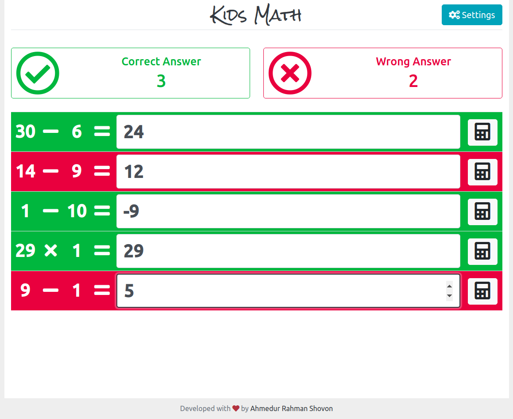

## Kids Math Web App

### Demo
- The app can be accessed from: [https://arshovon.com/apps/kids/](https://arshovon.com/apps/kids/)

### Features
- Math quiz generator for two operands and an operator.
- Quiz can be generated for both Bangla and English language.
- Maximum number for both operands can be controlled.
- Multiple types of operators can be chosen.
- Display total number of correct and wrong answers.
- Responsive design.

